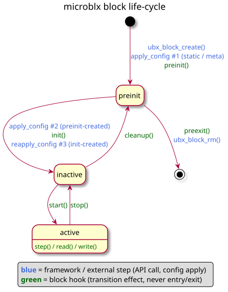

<div align="center">

**[microblx](../README.md) · [Install](../README.md#installing) · [Quickstart](../README.md#quickstart) · [Developing blocks](../README.md#developing-blocks) · [Composing systems](../README.md#composing-systems) · [Standard blocks](../README.md#standard-blocks) · Block reference · [usc reference](usc.md)**

</div>

# Block reference

Writing cblocks, iblocks and triggers in C. Snippets are from the
[random](../std_blocks/examples/random/random.c) example block. To
start, copy [`examples/oot-block`](../examples/oot-block/) (out of
tree) or [skelleton](../std_blocks/skelleton/) (annotated, in tree).

<!-- markdown-toc start - Don't edit this section. Run M-x markdown-toc-refresh-toc -->
**Table of Contents**

- [Configs](#configs)
- [Ports](#ports)
- [Meta-data](#meta-data)
- [Hooks and life cycle](#hooks-and-life-cycle)
- [Block local state](#block-local-state)
- [Reading configs](#reading-configs)
- [Reading and writing ports](#reading-and-writing-ports)
- [Declaring the block](#declaring-the-block)
- [Types](#types)
    - [Type safe accessors](#type-safe-accessors)
- [Module registration](#module-registration)
- [Logging](#logging)
- [Guidelines](#guidelines)
- [C++ and Lua blocks](#c-and-lua-blocks)
- [iblocks](#iblocks)
- [Triggers](#triggers)

<!-- markdown-toc end -->

## Configs

A `{ 0 }` terminated array of `ubx_proto_config_t`:

```c
ubx_proto_config_t rnd_config[] = {
	{ .name = "loglevel", .type_name = "int" },
	{ .name = "min_max_config", .type_name = "struct random_config", .min = 1, .max = 1 },
	{ 0 },
};
```

`min` and `max` constrain the array length, checked before `init`
(before `start` with `.attrs = CONFIG_ATTR_CHECKLATE`):

| min | max              | result                  |
|-----|------------------|-------------------------|
| 0   | 0 or unset       | no checking             |
| 0   | 1                | optional                |
| 1   | 1                | mandatory               |
| 0   | `CONFIG_LEN_MAX` | zero to many            |
| N   | M                | between N and M         |

Configs and ports take an optional `.doc` string, shown by
`ubx-modinfo`. Static definitions use the `ubx_proto_*` types, hooks
the runtime types (`ubx_config_t`, `ubx_port_t`, `ubx_block_t`).

## Ports

A `{ 0 }` terminated array of `ubx_proto_port_t`. `in_type_name`,
`out_type_name` or both make an in-, out- or in/out port.
`in_data_len`/`out_data_len` set the array length (default 1):

```c
ubx_proto_port_t rnd_ports[] = {
	{ .name = "seed", .in_type_name = "unsigned int" },
	{ .name = "rnd", .out_type_name = "unsigned int" },
	{ 0 },
};
```

## Meta-data

```c
char rnd_meta[] =
	"{ doc='A random number generator function block',"
	"  realtime=true,"
	"}";
```

- `doc`: short description
- `realtime`: `step` is real-time safe (no allocations or other
  non-deterministic calls)

## Hooks and life cycle

All hooks are optional:

```c
int  rnd_preinit(ubx_block_t *b);
int  rnd_init(ubx_block_t *b);
int  rnd_start(ubx_block_t *b);
void rnd_step(ubx_block_t *b);
void rnd_stop(ubx_block_t *b);
void rnd_cleanup(ubx_block_t *b);
void rnd_preexit(ubx_block_t *b);
```



| hook      | typical use                                                                         |
|-----------|-------------------------------------------------------------------------------------|
| `preinit` | extend the interface (add/resize ports, create configs) from static config values   |
| `init`    | allocate memory and resources, open the device, validate configs. Return 0 if OK    |
| `start`   | become operational: enable the device, cache port pointers, apply runtime configs   |
| `step`    | read ports, compute, write ports                                                    |
| `stop`    | disable the device (rarely used)                                                    |
| `cleanup` | free everything allocated in `init`                                                 |
| `preexit` | free private data allocated in `preinit` (ports and configs are freed by the framework) |

`preinit` and `init` both run in state `preinit` and may change the
interface. The deployment applies configs between them (see the
[launch sequence](usc.md#launch-sequence)): `preinit` sees only
the static configs, `init` also the configs created by `preinit`.
`ubx_block_init` runs `preinit` automatically. Blocks with a fixed
interface only need `init`..`cleanup`.

## Block local state

No globals: a block type can have many instances. Use
`b->private_data`:

```c
struct random_info {
	unsigned int min;
	unsigned int max;
};

int rnd_init(ubx_block_t *b)
{
	b->private_data = calloc(1, sizeof(struct random_info));

	if (b->private_data == NULL) {
		ubx_crit(b, "ENOMEM");
		return EOUTOFMEM;
	}
	return 0;
}

void rnd_cleanup(ubx_block_t *b)
{
	free(b->private_data);
}
```

## Reading configs

`cfg_getptr_<TYPE>` returns <0 on error, 0 if unconfigured, else the
array length, and points `val` to the data:

```c
long len;
const int *val;

if ((len = cfg_getptr_int(b, "myconfig", &val)) < 0)
	return -1;

int myconfig = (len > 0) ? *val : 47;	/* default 47 */
```

For custom types, define the accessor with a
[type macro](#type-safe-accessors):

```c
def_cfg_getptr_fun(cfg_getptr_random_config, struct random_config)

int rnd_start(ubx_block_t *b)
{
	long len;
	const struct random_config *rndconf;
	struct random_info *inf = b->private_data;

	len = cfg_getptr_random_config(b, "min_max_config", &rndconf);

	if (len < 0) {
		ubx_err(b, "failed to retrieve min_max_config");
		return -1;
	} else if (len == 0) {
		inf->min = 0;
		inf->max = INT_MAX;
	} else {
		inf->min = rndconf->min;
		inf->max = rndconf->max;
	}
	return 0;
}
```

Copying to `private_data` is only needed for defaults; otherwise use
the pointer directly. Permitted config changes per state:

| block state | allowed config changes |
|-------------|------------------------|
| `preinit`   | resize and change      |
| `inactive`  | change values          |
| `active`    | none                   |

Configs may be resized in `preinit`, so re-retrieve pointer and length
in `init`.

**init or start?** Read configs needed for initialization (e.g. a
device file) in `init`, others in `start`. Reconfiguring the former
takes `stop`, `cleanup`, `init`, `start`, the latter only `stop`,
`start`.

## Reading and writing ports

`read_<TYPE>` returns <0 on error, 0 if no data, else the array
length:

```c
ubx_port_t *p_rnd = ubx_port_get(b, "rnd");	/* cache in start */

unsigned int val = 1;
write_uint(p_rnd, &val);

long len;
int in;

len = read_int(p_in, &in);

if (len < 0)
	ubx_err(b, "port read failed");
else if (len == 0)
	;	/* no data */
else
	ubx_info(b, "new data: %i", in);
```

`read_<TYPE>_array` and `write_<TYPE>_array` handle arrays. Accessors
for all basic types are in `<ubx.h>`, for custom types see
[type safe accessors](#type-safe-accessors). Example:
[ramp](../std_blocks/ramp/ramp.c).

## Declaring the block

```c
ubx_proto_block_t random_comp = {
	.name = "ubx/random",
	.meta_data = rnd_meta,
	.type = BLOCK_TYPE_COMPUTATION,	/* or BLOCK_TYPE_INTERACTION */

	.ports = rnd_ports,
	.configs = rnd_config,

	.init = rnd_init,
	.start = rnd_start,
	.cleanup = rnd_cleanup,
	.step = rnd_step,
};
```

Optional `.attrs`:

| attribute            | meaning                     |
|----------------------|-----------------------------|
| `BLOCK_ATTR_ACTIVE`  | block runs its own thread   |
| `BLOCK_ATTR_TRIGGER` | block steps other blocks    |

`ubx-launch` starts active blocks last, the D-Bus `ClearNode` stops
trigger blocks before removing anything.

> **Note**: a block that steps other blocks (e.g. via a `struct
> ubx_triggee` chain) **must** declare `BLOCK_ATTR_TRIGGER`, otherwise
> it may step blocks that are being removed.

## Types

Config and port types must be registered: microblx needs their size,
and the header enables reflection (usc configs, `ubx-mq`, logging).

```c
/* types/random_config.h */
struct random_config {
	unsigned int min;
	unsigned int max;
};
```

```c
#include "types/random_config.h"
#include "types/random_config.h.hexarr"

ubx_type_t random_config_type = def_struct_type(struct random_config, &random_config_h);
```

The `.hexarr` is the header as a C char array (`random_config_h`),
generated by `tools/ubx-tocarr` in the build
([CMake](../std_blocks/examples/random/CMakeLists.txt): `generate_hexarr`).
At runtime it is loaded into the LuaJIT FFI. Without reflection, pass
`NULL` instead.

Rules for type headers (they are passed to `ffi.cdef`):

1. no `#include`: the C preprocessor is not run. Only use types the
   FFI knows (all builtins and `<stdint.h>` types).
2. one registered struct per header. Enums and unions used only by
   that struct may be in the same header.

Supported constructs:

```c
/* named enum field: Lua sees a number, usc configs also accept "BLUE" */
enum test_color { RED=0, GREEN=1, BLUE=2 };
struct test_with_enum { enum test_color col; int val; };

/* named union field: converted to a table of all members */
union test_variant { int i; float f; };
struct test_with_union { union test_variant v; unsigned char tag; };

/* anonymous union: members promoted to the struct, { i=42, selector=0 } */
struct test_with_anon_union { union { int i; float f; }; unsigned char selector; };

/* anonymous enum field: { kind="KIND_FLOAT", value=3 } */
struct test_with_anon_enum { enum { KIND_INT=0, KIND_FLOAT=1 } kind; int value; };
```

Custom conversion to Lua for a named struct or union (key includes
`struct`/`union`; anonymous ones can't be hooked, hook the containing
struct):

```lua
local cdata = require("cdata")

cdata.struct2tab["struct test_with_enum"] = function(cd)
   local names = { [0]="RED", [1]="GREEN", [2]="BLUE" }
   return { col = names[tonumber(cd.col)], val = tonumber(cd.val) }
end

-- expose only the active union member
cdata.struct2tab["union test_variant"] = function(cd) return tonumber(cd.i) end
```

### Type safe accessors

```c
def_type_accessors(SUFFIX, TYPENAME)

/* defines */
long read_SUFFIX(const ubx_port_t *p, TYPENAME *val);
int write_SUFFIX(const ubx_port_t *p, const TYPENAME *val);
long read_SUFFIX_array(const ubx_port_t *p, TYPENAME *val, const int len);
int write_SUFFIX_array(const ubx_port_t *p, const TYPENAME *val, const int len);
long cfg_getptr_SUFFIX(const ubx_block_t *b, const char *cfg_name, const TYPENAME **valptr);
```

| macro                                 | defines                    |
|---------------------------------------|----------------------------|
| `def_type_accessors(SUFFIX, TYPE)`    | port and config accessors  |
| `def_port_accessors(SUFFIX, TYPE)`    | port accessors             |
| `def_port_readers(FUNCNAME, TYPE)`    | port read accessors        |
| `def_port_writers(FUNCNAME, TYPE)`    | port write accessors       |
| `def_cfg_getptr_fun(FUNCNAME, TYPE)`  | config getter              |
| `def_cfg_set_fun(FUNCNAME, TYPE)`     | config setter (launching from C) |

## Module registration

```c
int rnd_module_init(ubx_node_t *nd)
{
	if (ubx_type_register(nd, &random_config_type))
		return -1;
	return ubx_block_register(nd, &random_comp);
}

void rnd_module_cleanup(ubx_node_t *nd)
{
	ubx_type_unregister(nd, "struct random_config");
	ubx_block_unregister(nd, "ubx/random");
}

UBX_MODULE_INIT(rnd_module_init)
UBX_MODULE_CLEANUP(rnd_module_cleanup)
UBX_MODULE_LICENSE_SPDX(BSD-3-Clause)
```

The license is an [SPDX](https://spdx.org/licenses) identifier,
dual-licensing: `UBX_MODULE_LICENSE_SPDX(MPL-2.0 BSD-3-Clause)`.

## Logging

Real-time safe, kernel-style levels. Set the node level with
`ubx-launch -l N`, override per block with an `int` config `loglevel`.
View the log with `ubx-log`.

```c
ubx_emerg(b, fmt, ...)	/* 0 system unusable */
ubx_alert(b, fmt, ...)	/* 1 immediate action required */
ubx_crit(b, fmt, ...)	/* 2 critical */
ubx_err(b, fmt, ...)	/* 3 error */
ubx_warn(b, fmt, ...)	/* 4 warning */
ubx_notice(b, fmt, ...)	/* 5 normal but significant */
ubx_info(b, fmt, ...)	/* 6 info */
ubx_debug(b, fmt, ...)	/* 7 debug: compiled out unless UBX_DEBUG is defined */
```

Outside of a block (e.g. in `module_init`):

```c
ubx_log(UBX_LOGLEVEL_ERROR, nd, __func__, "error %u", x);
```

Messages are truncated at `UBX_LOG_MSG_MAXLEN` (see
[build options](../README.md#build-options)).

## Guidelines

- use `long` for type related lengths and sizes: large enough, and
  errors can be returned negative (e.g. `cfg_getptr_uint32`).
- blocks with configurable data type and length use the canonical
  configs `type_name` and `data_len`.
- cache port pointers in `start` (or `init`): simpler, and saves a
  hash lookup per `step`.
- add `-fvisibility=hidden` to `CFLAGS` instead of making all
  functions `static`.
- configurable array size: see [saturation](../std_blocks/saturation/saturation.c).
  Multiple types at compile time: [ramp](../std_blocks/ramp/ramp.c), at
  runtime: [lfrb](../std_blocks/lfrb/lfrb.c).

## C++ and Lua blocks

- C++: see [cppdemo](../std_blocks/cppdemo/). Designated initializers for
  `ubx_proto_*` need g++ >= 8.
- Lua: see [luablock](../std_blocks/luablock/README.md).

## iblocks

An iblock connects cblock ports. Differences to a cblock:

- `.type = BLOCK_TYPE_INTERACTION`, with `read` and `write` hooks
  instead of `step`.
- `write_<TYPE>()` on an out-port calls `write` of all connected
  active iblocks; `read_<TYPE>()` on an in-port calls `read` of the
  connected iblocks until one returns data.
- configure the transported type with the canonical configs
  `type_name` and `data_len`, resolve it in `init` with
  `ubx_type_get(b->nd, type_name)`.

```c
/* store msg->len elements of msg->type from msg->data */
void myib_write(ubx_block_t *i, const ubx_data_t *msg);

/* copy at most msg->len elements to msg->data.
 * return the number of elements, 0 if no new data, <0 on error */
long myib_read(ubx_block_t *i, ubx_data_t *msg);

ubx_proto_block_t myib_block = {
	.name = "my/ib",
	.type = BLOCK_TYPE_INTERACTION,
	.configs = myib_config,	/* type_name, data_len, ... */
	.init = myib_init,
	.cleanup = myib_cleanup,
	.write = myib_write,
	.read = myib_read,
};
```

Check `msg->type` against the configured type and use
`data_size(msg)` for the size in bytes. A minimal real one:
[vstore](../std_blocks/vstore/vstore.c).

## Triggers

A trigger is a cblock that steps a chain of blocks, e.g. on an
external event. Differences:

- `.attrs = BLOCK_ATTR_TRIGGER` (plus `BLOCK_ATTR_ACTIVE` if it runs
  its own thread).
- a chain config of type `struct ubx_triggee`, set in usc as
  `{ { b="#blk", num_steps=1, every=1 }, ... }`.
- `libubx/trig_utils.h` does the stepping and timing statistics:

```c
#include "trig_utils.h"

ubx_proto_config_t mytrig_config[] = {
	{ .name = "chain0", .type_name = "struct ubx_triggee" },
	{ 0 },
};

struct mytrig_info {
	struct ubx_chain chain;
};

int mytrig_start(ubx_block_t *b)
{
	struct mytrig_info *inf = b->private_data;

	inf->chain.triggees_len = cfg_getptr_triggee(b, "chain0", &inf->chain.triggees);
	if (inf->chain.triggees_len < 0)
		return -1;
	inf->chain.tstats_mode = TSTATS_DISABLED;

	return ubx_chain_init(&inf->chain, "chain0", 0);
}

/* on each event */
ubx_chain_trigger(&inf->chain);

/* in cleanup */
ubx_chain_cleanup(&inf->chain);
```

Reference: [trig](../std_blocks/trig/trig.c) and
[common.c](../std_blocks/trig/common.c).
