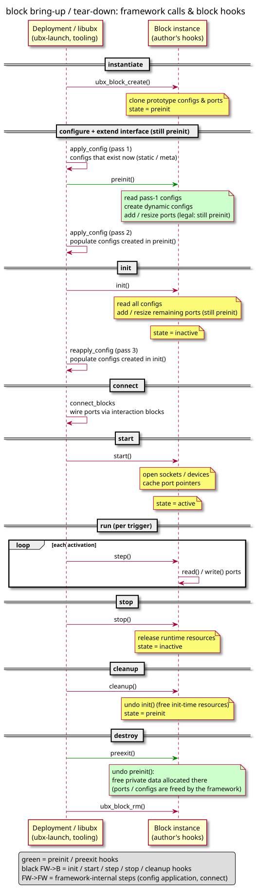

# usc reference

A usc file is a Lua file returning a `bd.system`. `ubx-launch`
validates it, instantiates it in a node and starts it. `bd` (the
`blockdiagram` module) is available as a global.

<!-- markdown-toc start - Don't edit this section. Run M-x markdown-toc-refresh-toc -->
**Table of Contents**

- [System](#system)
- [Blocks](#blocks)
    - [Lua blocks](#lua-blocks)
- [Configurations](#configurations)
    - [Block references](#block-references)
    - [Node configurations](#node-configurations)
- [Triggers](#triggers)
- [Connections](#connections)
    - [cblock to cblock](#cblock-to-cblock)
    - [cblock to existing iblock](#cblock-to-existing-iblock)
    - [cblock to new iblock](#cblock-to-new-iblock)
- [External blocks](#external-blocks)
- [Subsystems](#subsystems)
    - [Merging subsystems](#merging-subsystems)
- [Mixins](#mixins)
- [Model parameters](#model-parameters)
- [Launching](#launching)
    - [Launch sequence](#launch-sequence)
- [Alternatives to usc](#alternatives-to-usc)

<!-- markdown-toc end -->

## System

```lua
return bd.system {
   imports = { "stdtypes", "ptrig", "lfrb", "myblocks" },  -- modules to load

   blocks = {                                    -- block instances
      { name="x1", type="myblocks/x" },
      { name="y1", type="myblocks/y" },
      { name="trig1", type="ubx/ptrig" },
   },

   connections = {                               -- port connections
      { src="x1.out", tgt="y1.in" },
      { src="y1.out", tgt="x1.in", config={ buffer_len=16 } },
   },

   configurations = {                            -- block configs
      { name="x1", config = { cfg1="foo", cfg2=33.4 } },
      { name="y1", config = { cfgA={ p=1, z=22.3 }, cfg2=33.4 } },
      { name="trig1", config = { period = { sec=0, usec=100000 },
                                 chain0 = { { b="#x1" }, { b="#y1", every=2 } } } },
   },

   node_configurations = { ... },               -- shared configs
   extern_blocks = { ... },                     -- blocks already in the node
   subsystems = { ... },                        -- nested systems
}
```

All keys are optional. Unknown keys are validation errors.

## Blocks

```lua
blocks = {
   { name="ramp1", type="ubx/ramp" },
}
```

`type` is the prototype block name as registered by a module in
`imports`. `ubx-modinfo show <module>` lists the blocks of a module.

### Lua blocks

A `luablock:NAME` type instantiates the Lua block `NAME.lua` found in
the standard block prefixes. No import of `luablock` and no
`lua_file` config are needed:

```lua
blocks = {
   { name="myblk", type="luablock:myluablock" },
},
configurations = {
   -- optional: self-trigger every 100 ms, no ptrig needed for non-RT use
   { name="myblk", config = { thread=1, period=100 } },
},
```

Short blocks can be given inline with the `lua_str` config instead.
See [luablock](../std_blocks/luablock/README.md).

## Configurations

```lua
configurations = {
   { name="ramp1", config = { type="double", data_len=2, slope={ 1, 2 } } },
}
```

Values map to the config types: scalars, arrays as Lua tables, structs
as tables with field names, arrays of structs as tables of tables.
Enum fields accept the numeric or the symbolic value (`color="BLUE"`).

### Block references

`"#NAME"` in a config value is replaced by a pointer to block `NAME`
at launch. Used mainly in trigger chains. References are checked at
validation time.

### Node configurations

A node configuration is one value shared by several blocks:

```lua
node_configurations = {
   global_rnd_conf = {
      type = "struct random_config",
      config = { min=333, max=999 },
   },
},

configurations = {
   { name="b1", config = { min_max_config = "&global_rnd_conf" } },
   { name="b2", config = { min_max_config = "&global_rnd_conf" } },
},
```

Example: [`node_config_demo.usc`](../examples/usc/node_config_demo.usc).

## Triggers

A trigger is a block with `chainN` configs of type
`struct ubx_triggee[]`. Each entry steps block `b` `num_steps` times
(default 1), on every `every`-th trigger step (default 1):

```lua
{ name="trig1", config = {
     period = { sec=0, usec=1000 },
     sched_policy = "SCHED_FIFO", sched_priority = 80,
     chain0 = {
        { b="#x1" },
        { b="#y1", num_steps=1, every=2 },
     } } },
```

Scheduling (`SCHED_OTHER`, `SCHED_FIFO`, `SCHED_RR`, `SCHED_DEADLINE`),
affinity, sleep modes, timing statistics etc. are described in
[trig/ptrig](../std_blocks/trig/README.md).

## Connections

`src` and `tgt` are `BLOCK.PORT` for cblocks and `BLOCK` for iblocks.

### cblock to cblock

```lua
{ src="blkA.portX", tgt="blkB.portY" }
{ src="blkA.portX", tgt="blkB.portY", type="ubx/lfrb", config={ buffer_len=8 } }
```

- both blocks and ports must exist.
- an iblock of `type` is created for the connection, default
  `ubx/lfrb`. `ubx/vstore` (writer and reader in the same trigger
  chain) and `ubx/latch` (reader always gets the latest value) fit
  special cases, see [vstore](../std_blocks/vstore/README.md) and
  [latch](../std_blocks/latch/README.md) for the preconditions.
- `config` is applied to the new iblock. `type_name` and `data_len`
  are set from the ports unless given.

### cblock to existing iblock

```lua
{ src="blkX.portZ", tgt="myMQ" }
{ src="myMQ", tgt="blkX.portZ" }
```

- the iblock is given without port.
- `type` and `config` are ignored with a warning.

### cblock to new iblock

Leave out `src` or `tgt` and set `type`: an iblock with a unique name
is created and connected:

```lua
{ src="blkX.portZ", type="ubx/mqueue", config={ buffer_len=32 } }
```

- `type_name`, `data_len` and `buffer_len` are set unless given in
  `config`.
- `ubx/mqueue`: `mq_id` defaults to the peer `BLOCK.PORT`, here
  `blkX.portZ`. Read it with `ubx-mq read blkX.portZ`.

A port connected to several readers gets one iblock per connection,
so each reader sees all data.

## External blocks

`extern_blocks` lists blocks that already exist in the node. Used when
loading a composition into a running node (e.g. via the `LoadUSCLua`
method of [lsdb-intf](../std_blocks/lsdb-intf/README.md)):

```lua
return bd.system {
   imports = { "stdtypes", "lfrb", "myblocks" },
   extern_blocks = { "core_sensor", "core_actuator" },
   blocks = { { name="controller", type="myblocks/ctrl" } },
   connections = {
      { src="core_sensor.out", tgt="controller.in" },
      { src="controller.out", tgt="core_actuator.in" },
   },
}
```

References to blocks in neither `blocks` nor `extern_blocks` are
validation errors.

## Subsystems

`subsystems` composes a system from other systems, each under a
namespace:

```lua
return bd.system {
   subsystems = {
      sub11 = bd.load("subsys1.usc"),
      sub12 = bd.load("subsys1.usc"),
   },
   configurations = {
      { name="sub11/blk",       config = { cfgA=1, cfgB=2 } },
      { name="sub11/sub21/blk", config = { cfgA=5, cfgB=6 } },
   },
   connections = {
      { src="sub11/sub21/blk.portX", tgt="sub11/blk.portY" },
   },
}
```

- block names are fully qualified (`sub11/sub21/blk`), also for
  `#sub11/blk` references.
- modules are imported once.
- all blocks of all levels are instantiated, configured and started
  together: the hierarchy does not affect the startup order.
- if several configs exist for a block, the highest one in the
  hierarchy wins.
- node configurations are global (no prefix). Of identically named
  ones, the highest one in the hierarchy wins.

Example: [`examples/usc/pid/`](../examples/usc/pid/) and
[`examples/usc/composition/`](../examples/usc/composition/).
Background: [001-blockdiagram-composition](dev/001-blockdiagram-composition.md).

### Merging subsystems

A subsystem without a namespace is merged into the parent. On
conflicts the parent entries win:

```lua
return bd.system {
   subsystems = { bd.load("subsys1.usc") },
}
```

## Mixins

Keep reusable compositions free of platform specifics: use a passive
`ubx/trig` for the schedule and add the `ubx/ptrig` (and its
priorities) in a separate usc at launch time:

```sh
ubx-launch --webgraph -c deep_composition.usc,ptrig.usc
```

Unlike [merging](#merging-subsystems) from within a usc, models
merged on the command line *override* existing entries.

## Model parameters

```lua
local PERIOD  = bd.param("PERIOD",  1000, "trigger period [us]")
local GRIPPER = bd.param("GRIPPER", 0,    "1 = gripper attached")

return bd.system { ... }
```

```sh
ubx-launch -c arm.usc --params                   # list parameters
ubx-launch -c arm.usc -D PERIOD=500 -D GRIPPER=1
```

`ubx-dbus --load-usc` supports the same options.

- `-D` for a parameter no loaded model declares is an error.
- the value is converted to the type of the default (number or
  string). A non-numeric value for a number is an error. `nan` and
  `inf` are numbers.
- names match `[A-Za-z_][A-Za-z0-9_]*` and are global across all
  loaded models: submodels from `bd.load()` and models merged on the
  command line. A submodel included twice reads the same value.
- a function as default makes the parameter required: launching
  without `-D` for it is an error, the value is converted with the
  function and a `nil` result is an error. `--params` shows
  `<required>`:

  ```lua
  local IP   = bd.param("IP",   tostring, "target IP")
  local PORT = bd.param("PORT", tonumber, "target port")
  ```

  `--params` loads without values, so a required parameter is `nil`
  there. If the model fails on it (e.g. `PORT + 1` at the top level),
  `--params` lists what was declared so far and fails with `listing
  incomplete`. Use the value only inside the `bd.system` spec.
- several models may declare a parameter only with the same default.
  Different defaults are an error, or a warning (an error with
  `--werror`) if the value is given with `-D`.
- an optional fourth argument validates the value: a function or
  callable table (e.g. a [tableshape](https://github.com/leafo/tableshape)
  type) that receives the default and the converted value and returns
  `true`, or `false`/`nil` and an error message:

  ```lua
  local PERIOD = bd.param("PERIOD", 1000, "trigger period [us], > 0",
                          function(v) return v > 0, "must be > 0" end)
  ```

  Each declaration runs its own check. `--params` cannot show a
  check, so describe the constraint in the help text.
- declare parameters unconditionally at the top: a declaration in a
  branch not taken is unknown to `-D` and `--params`.
- outside `ubx-launch` and `ubx-dbus` (e.g. `bd.load()` in a script),
  `bd.param()` returns the default. To pass values, load inside
  `bd.with_params(values, func)`.

Example: [`threshold.usc`](../examples/usc/threshold.usc).

## Launching

```sh
ubx-launch -c app.usc                     # launch, stop with Ctrl-C
ubx-launch -c app.usc,ptrig_rt.usc        # merge, then launch
ubx-launch -c app.usc --validate          # check only
ubx-launch -c app.usc --nostart           # instantiate and configure only
ubx-launch -c app.usc -t 10 -l 7          # run 10 s at loglevel DEBUG
ubx-launch -c app.usc --webgraph          # live graph on http://localhost:8888
ubx-launch -h                             # all options
```

Unless `--nostart` is given, all blocks are initialized, configured
and started. Blocks with `BLOCK_ATTR_ACTIVE` (e.g. `ptrig`) are
started last.

### Launch sequence

Configuration is applied in several passes, so `preinit` and `init`
can extend the block interface based on config values (see the
[block life cycle](../README.md#hooks-and-life-cycle)):



## Alternatives to usc

- **C**: launch without Lua, see [`examples/C/c-launch.c`](../examples/C/).
- **Lua scripts**: write a deployment script like `ubx-launch` using
  the `ubx` and `blockdiagram` modules. Only recommended for special
  cases such as dedicated test tools.
