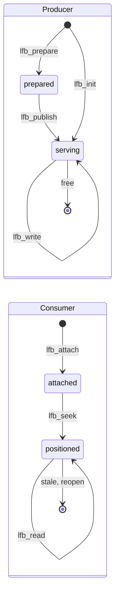

# lfb — lock-free broadcast buffer

Header-only C11 lossy broadcast ring: **one producer, many independent
readers**. For pushing log messages, samples or state from a real-time
thread to non-RT observers.

- lossy: a full ring overwrites its oldest frame
- producer never blocks or allocates: memcpy + one release-store
- readers: private cursors, mutually independent; one that falls behind
  gets `-EPIPE` and resyncs, slowing no one
- delivered frames always intact (torn reads detected and dropped)
- two variants: **core** (`lfb.h`, buffer in any memory, no syscalls)
  and **shm** (`lfb_shm.h`, cross-process POSIX shm)

## Quick start (shm)

Producer:

```c
#include <lfb.h>
#include <lfb_shm.h>

struct sample { uint64_t ts; double val; };
lfb_shm_t s;

/* fresh 4096-frame segment, no user area */
int ret = lfb_shm_create(&s, "samples", sizeof(struct sample), 4096, 0);
if (ret != 0)
	errx(1, "shm_create: %s", strerror(-ret));

struct sample smp = { .ts = now(), .val = 42.0 };
lfb_write(lfb_shm_lfb(&s), &smp);   /* never blocks, never fails */

lfb_shm_destroy(&s);
```

Consumer:

```c
lfb_shm_t s;
lfb_rd_t rd;
struct sample smp;

while (lfb_shm_open(&s, "samples") != 0)   /* wait for the producer */
	usleep(1000);

lfb_seek(lfb_shm_lfb(&s), &rd, LFB_OLDEST);

for (;;) {
	int ret = lfb_read(&rd, &smp);

	if (ret == 1)              /* got a frame */
		consume(&smp);
	else if (ret == 0)         /* empty, poll again */
		usleep(1000);
	else                       /* -EPIPE: fell behind, cursor resynced */
		warnx("lost frames");

	if (lfb_shm_stale(&s))     /* producer restarted -> reopen */
		break;
}
```

## Lifecycle

A buffer is set up once by its producer, then written and read
concurrently until torn down. The shm calls wrap the core ones.



- **prepared → serving**: the two-phase split lets the producer fill the
  user area (`lfb_user`, e.g. a process-shared lock) before the buffer
  is attachable; `lfb_init` fuses both when no setup is needed.
- **shm mapping**: `lfb_shm_create` = `lfb_init`; `lfb_shm_join` /
  `lfb_shm_publish` = `lfb_prepare` / `lfb_publish` (co-producers);
  `lfb_shm_open` = `lfb_attach`; `lfb_shm_stale` flags a restarted
  producer (reopen); `lfb_shm_destroy` / `lfb_shm_close` = free.

## API

### Core (`lfb.h`) — buffer in any memory, no syscalls

| step        | function                                        | purpose                                             |
|-------------|-------------------------------------------------|-----------------------------------------------------|
| **init**    | `lfb_init(mem, sz, fs, d, usz)`                 | producer: init a ready-to-use buffer in `mem`       |
|             | `lfb_attach(mem, sz)`                           | consumer: attach to an existing buffer              |
| **write**   | `lfb_write(b, frame)`                           | copy in and publish a frame (RT-safe)               |
|             | `lfb_get_wslot(b)` / `lfb_commit_wslot(b)`      | zero-copy write ([below](#zero-copy))               |
| **read**    | `lfb_seek(b, rd, whence)`                       | position a cursor: `LFB_OLDEST` / `LFB_NEWEST`      |
|             | `lfb_read(rd, frame)`                           | `1` = frame, `0` = empty, `-EPIPE` = overrun        |
|             | `lfb_lag(rd)`                                   | unread frames (headroom to overrun = `depth - lag`) |
|             | `lfb_get_rslot(rd, &p)` / `lfb_check_rslot(rd)` | zero-copy read ([below](#zero-copy))                |
| **cleanup** | —                                               | free `mem` yourself once all readers are done       |

> *Note*: `lfb_init` = `lfb_prepare` + `lfb_publish` — call them separately to
> set up the user area (`lfb_user` / `lfb_cuser`, e.g. a process-shared
> lock) before the buffer becomes attachable. Size the region with
> `lfb_memsz(fs, d, usz)`.

### Shared memory (`lfb_shm.h`) — buffer in a POSIX shm segment

Read and write with the core ops above, applied to `lfb_shm_lfb(s)`.

| step        | function                              | purpose                                                                         |
|-------------|---------------------------------------|---------------------------------------------------------------------------------|
| **init**    | `lfb_shm_create(s, name, fs, d, usz)` | producer: fresh segment (leftovers never reused)                                |
|             | `lfb_shm_open(s, name)`               | consumer: map read-only (`-ENOENT`/`-EAGAIN` = retry, `-EPROTO` = incompatible) |
|             | `lfb_shm_lfb(s)`                      | the `lfb_t` to pass to the core ops                                             |
| **use**     | `lfb_shm_stale(s)`                    | consumer: producer restarted? then reopen                                       |
| **cleanup** | `lfb_shm_destroy(s)`                  | producer: unmap and unlink                                                      |
|             | `lfb_shm_close(s)`                    | consumer: unmap                                                                 |

> *Note*: co-producers — several writers sharing one segment behind a
> shared lock — replace `lfb_shm_create` with `lfb_shm_join` /
> `lfb_shm_publish`. This is how rtlog serializes its writers.

A segment is never reused or resized in place: a (re)starting producer
unlinks and recreates, so crashes leave no stale state. Consumers keep
their old mapping until they notice via `lfb_shm_stale` and reopen, and
never see a half-built or foreign segment (rejected by fingerprint).

## Zero-copy

Skip the memcpy — for large frames, or many readers (each copies the
whole frame). Ties with the simple API otherwise.

Producer — fill in place, then commit:

```c
struct sample *smp = lfb_get_wslot(b);
smp->ts = now();
smp->val = measure();
lfb_commit_wslot(b);              /* now visible to readers */
```

Consumer — borrow, read, check it survived:

```c
const void *f;

if (lfb_get_rslot(&rd, &f) == 1) {
	n = parse(scratch, f);            /* provisional! */
	if (lfb_check_rslot(&rd) == 1)    /* frame stayed intact? */
		emit(scratch, n);
	/* else -EPIPE: discard, cursor resynced */
}
```

The producer may overwrite the slot mid-borrow, so treat everything from
the frame as provisional until `lfb_check_rslot` returns 1: compute into
a scratch buffer, publish only after. **A torn frame holds arbitrary
bytes** — bounds-check any length or offset read from it. Reading within
`frame_size` is always safe.

## Configuration (optional)

Defaults suit 64-bit. To override, define before including `lfb.h` (all
parties must agree):

```c
#define LFB_CTR_BITS 32   /* word width; 32 for 32-bit ARMs w/o 64-bit atomics */
#define LFB_OFF_BITS 16   /* slot-offset bits; max depth 2^16, rest = wrap counter */
#include <lfb.h>
```

Keep at least 8 wrap bits, or a reader stalled for many laps may miss an
overrun.

## Building

Header-only — add this directory to the include path (`-lrt` for
`lfb_shm.h` on older glibc). In microblx the main build installs the
headers to `include/ubx/`.

## Tests

- `test-lfb-unit`, `test-lfb-shm-unit`: cmocka unit tests.
- `test-lfb`: multi-reader stress test; `-O` forces and checks overrun recovery.
- `bench-lfb-shm`: multi-process benchmark (`-P` zero-copy, `-R` rate,
  `-p` pin cores; `-h` for all).

TSAN-clean under `-fsanitize=thread` for `lfb_write`/`lfb_read` (the copy
switches to relaxed atomic bytes). The zero-copy paths are not — the
caller's own frame accesses show up as races.

## Limitations

- one producer (serialize extra writers with a lock, as rtlog does)
- lossy: slow readers lose data, detectably. Not a queue — see liblfq for MPMC
- needs lock-free (address-free) C11 atomics of the chosen width

## License

MPL-2.0 (see the SPDX headers in the sources).
